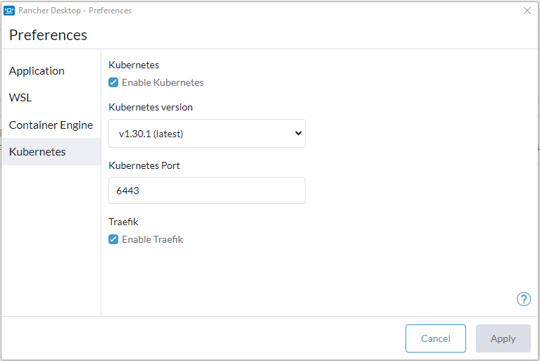
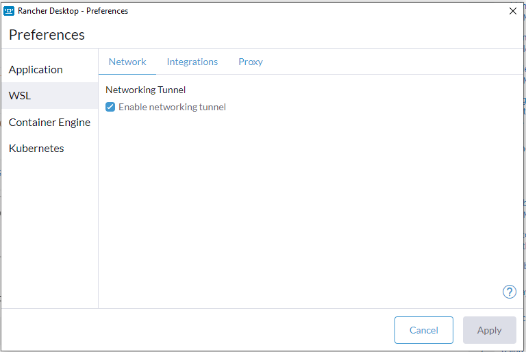
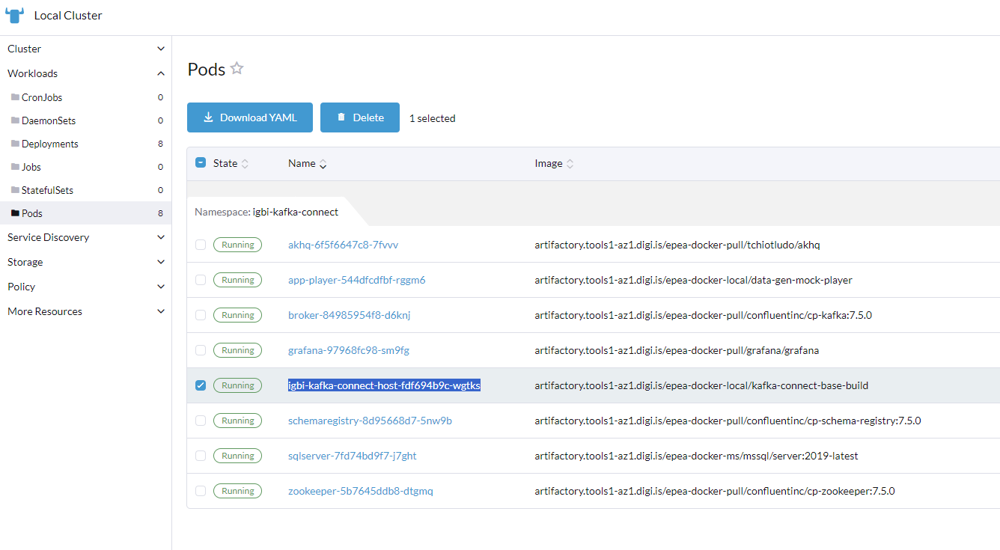

# KAFKA CONNECT
To set up a comprehensive project for productionizing kafka connect in a Kubernetes and Rancher environment, we can break down the process into several steps, each focusing on a key aspect of customization, clustering, backup and restore, security, and monitoring. Here is a step-by-step guide that builds up functionality using practical examples.

-------------------
### Step 1: Setting Up Kubernetes Environment
**Activate Kubernetes in Rancher Desktop**  
Go to "Preferences" in Rancher Desktop and enable Kubernetes and Traefik.  


Go to the WSL tab and enable networking tunnel.



Rancher desktop should now start kubernetes for you.

-------------------
### Step 2: Setup
**Create a namespace:**
```sh
kubectl apply -f .\local\namespace.yaml
```
**Switch context to namespace:**
```sh
kubectl config set-context --current --namespace=igbi-kafka-connect
```
-------------------
### Step 3: Supporting App Setup
The following app ecosystem will be created:
- Kafka zookeeper
- Kafka broker
- Kafka schema registry
- Kafka connect
- Grafana
- Akhq
- SQL Server Instance

**Create supporting apps:**
```sh
kubectl apply -f .\local\apps
```

**Create Database Objects:**
```sql
CREATE DATABASE dbPromotions;
```

**Start source connector:**  
Get the name of the kafka connect pod from rancher desktop.


**Connect to the pod:**
```sh
kubectl exec --stdin --tty <pod-name> -- /bin/sh
```

**Create the source connector:**
```sh
curl -X POST -H "Content-Type: application/json" --data '{
  "name": "EVT_IGBI_KAFKA_PLAYERPROMOMARKETING",  
  "config": {
    "connector.class": "io.confluent.connect.jdbc.JdbcSourceConnector",
    "tasks.max": 1,
    "key.converter": "io.confluent.connect.avro.AvroConverter",
    "value.converter": "io.confluent.connect.avro.AvroConverter",
    "key.converter.schema.registry.url": "http://schemaregistry:8081",
    "value.converter.schema.registry.url": "http://schemaregistry:8081",
    "connection.url": "jdbc:sqlserver://CPTBIDev02.capetown.fwslash.net;databaseName=dbPromotions",
    "connection.user": "svc_IGIKafkaUser",
    "connection.password": "1g1K@fK@u53r!@#",
     "transforms": "route",
    "transforms.route.type": "org.apache.kafka.connect.transforms.RegexRouter",
    "transforms.route.regex": ".*",   
    "transforms.route.replacement" : "EVT_DOSCPT_IGBI_LOCAL_PLAYERPROMOMARKETING",
    "mode": "timestamp",
    "timestamp.column.name": "LastModified",
    "numeric.precision.mapping": "true",
    "numeric.mapping": "best_fit",
    "query": "SELECT * FROM (SELECT [CustomerID],[UserID],[CasinoId],[GamingServerId],[PlayerLifecycle],[Eligible],[PrimaryOffer],[CouponValue],[ValidFrom],[ValidTo],[BirthdayOffer],[StartDate],[EndDate],[SuggestedBonus],[BehaviourCat],[CustomerMajoritySegment],[CustomerPurchaseLifeTimeSegment],[SoftLapsedDays],[SoftLapsedReason],[GameGroupCat1],[GameGroupCat2],[GameGroupCat3],[ABTestFlag],[lastModified] FROM [dbPromotions].[dbo].[PlayerPromoMarketing] WITH (NOLOCK)) AS PlayerPromoMarketing",
    "table.type":"TABLE",
    "poll,interval.ms": "250",
    "batch.max.rows": "10000",
    "topics": "EVT_DOSCPT_IGBI_LOCAL_PLAYERPROMOMARKETING"
  }
}' "http://localhost:8083/connectors"
```

**Create the sink connector:**
```sh
curl -X POST -H "Content-Type: application/json" --data '{
  "name": "EVT_KAFKA_IGBI_PLAYERPROMOMARKETING",  
  "config": {
    "connector.class": "io.confluent.connect.jdbc.JdbcSinkConnector",
    "tasks.max": "1",
    "topics": "EVT_DOSCPT_IGBI_LOCAL_PLAYERPROMOMARKETING",
    "key.converter": "io.confluent.connect.avro.AvroConverter",
    "value.converter": "io.confluent.connect.avro.AvroConverter",
    "key.converter.schema.registry.url": "http://schemaregistry:8081",
    "value.converter.schema.registry.url": "http://schemaregistry:8081",
    "connection.url": "jdbc:sqlserver://sqlserver;databaseName=dbPromotions",
    "connection.user": "sa",
    "connection.password": "sql@dm1n",
    "auto.create": "true",
    "auto.evolve": "true",
    "insert.mode": "insert",
    "batch.size": "5000",
    "table.name.format": "PlayerPromoMarketing"
  }
}' "http://localhost:8083/connectors"
```

**To Delete a connector:**
```sh
curl -X DELETE localhost:8083/connectors/EVT_IGBI_KAFKA_PLAYERPROMOMARKETING
```

-------------------
### Clustering
Configure kafka connect in a clustered setup to ensure high availability and scalability.

**Cluster Setup:**   
**Add Read Replicas:**  

-------------------
### Monitoring and Maintenance
Set up monitoring and logging to keep track of your kafka cluster’s performance and health.

**Prometheus and Grafana:**  
Integrate with Prometheus for metrics collection and Grafana for visualization.  

-------------------
### Conclusion
By following these steps, you can set up a production-ready Neo4j deployment in a Kubernetes and Rancher environment, covering key aspects such as customization, clustering and monitoring.

-------------------
